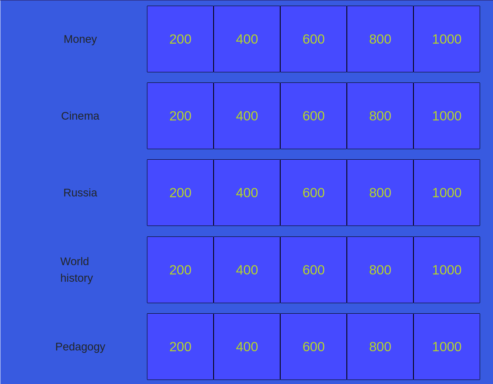
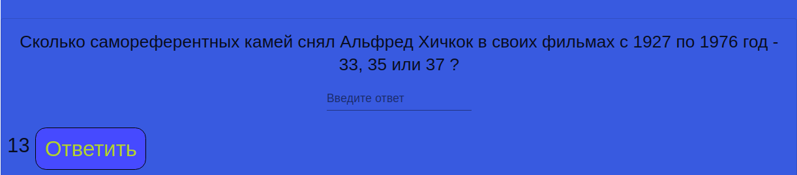
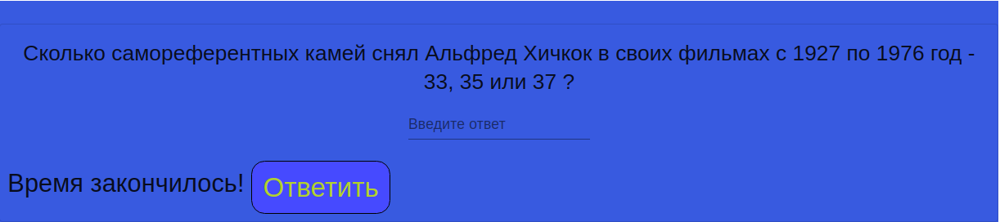

# Jeopardy-Game

Игра под названием "Своя игра". Участнику задаются вопросы на эрудицию. За каждый правильный ответ участнику начисляются баллы, за каждый неправильный ответ баллы списываются.

Techs: HTML, CSS, JavaScript, Express.js, Node.js, MongoDB, React, Redux, Material UI, React Bootstrap.

    
    
    

